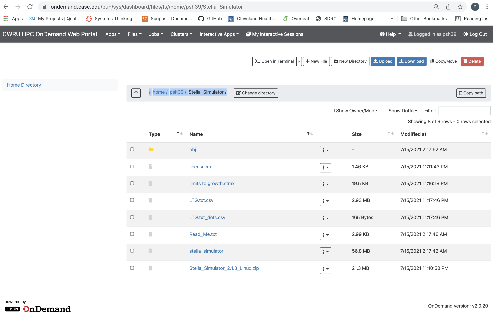

```{r setup, include=FALSE}
knitr::opts_chunk$set(echo = TRUE)
```

# Accessing the High Performance Computing (HPC) cluster

The easiest way to get started with the HPC is to go to the OnDemand web portal, where you can develop and test code interactively using RStudio server and submit/manage batch jobs that require more computationally intensive resources in terms of memory and cores. 

You can access the the OnDemand web portal by going to https://ondemand.case.edu, where you may be prompted to enter your user name, password, and 2-factor authentication. Once you have been added to the CBSD Lab group under psh39, you should be able to access the CBSD Lab Stella Simulator license. 

To check this, change your directory to /home/psh39/Stella_Simulator, and you should see the following files:

{width=100%}
# Running a simulation


